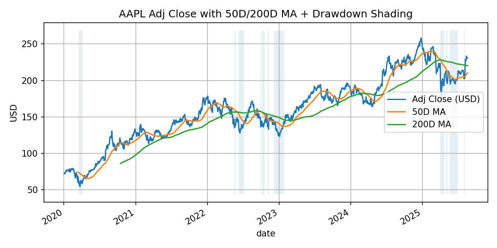

# Financial Market Dashboard (Python · MySQL · Tableau)

Interactive analytics for U.S. equities: **price trends, volumes, sector performance**, and a foundation for **forecasting**.  
Built with **Python (pandas, yfinance)** for ingestion, **MySQL** for storage, and **Tableau** (planned) for dashboards.

  

  

---

## Highlights
- Automated **multi-ticker** OHLCV ingestion via `yfinance`
- **Normalized SQL schema** with `UNIQUE (ticker, date)` for clean loads
- Reproducible Python scripts to **save charts** for the README
- Ready to compute **returns, moving averages, volatility, cumulative return**
- Designed for **Tableau** connection (CSV or live MySQL)

---

## Stack
**Python**: pandas, numpy, yfinance, SQLAlchemy, python-dotenv, matplotlib  
**Database**: MySQL 8 (local via Homebrew)  
**Viz**: Tableau Public/Desktop (planned)

---

## 📂 Repository Structure
